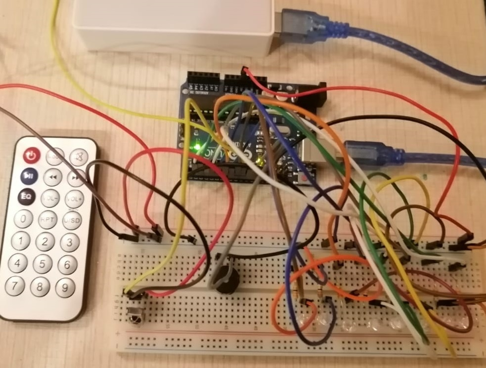

# IOT Smart Home (Using IR Remote to control your home) 

# Smart Lighting
1. Turn ON/OFF light

2. Choose between different 6 modes of lighting

3. Control the speed of lighting

# Smart Gate
&nbsp;&nbsp;&nbsp;&nbsp;Open/Close the gate

# 📷

